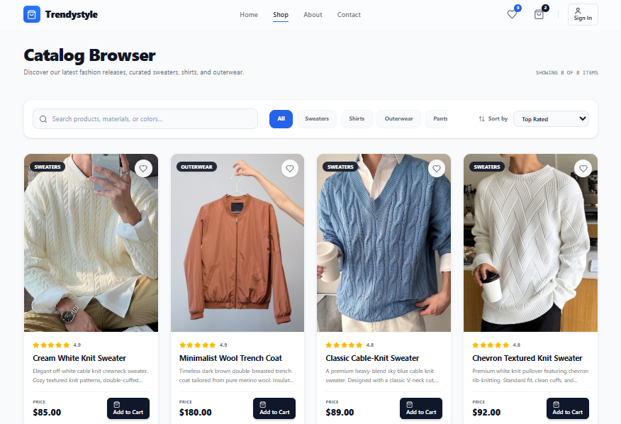
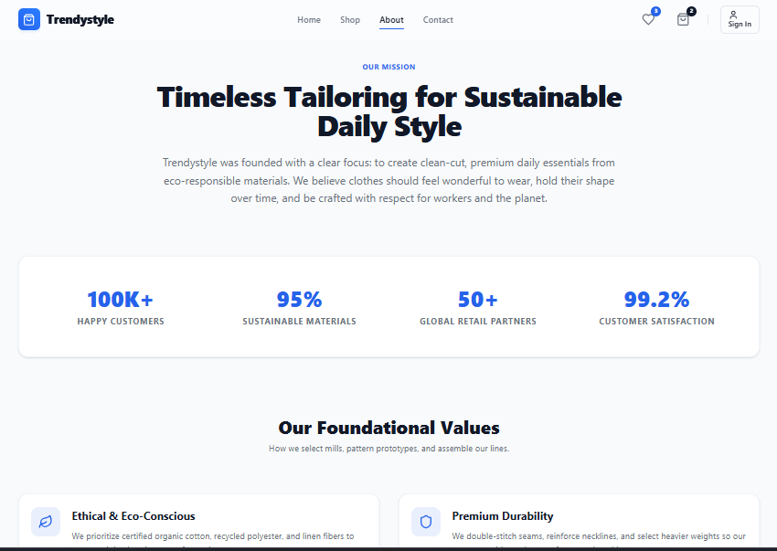
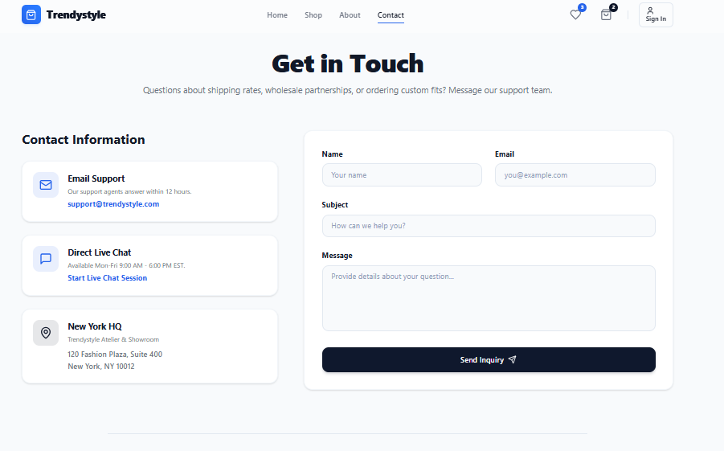

# Trendystyle — Premium Slow-Fashion eCommerce Storefront

Trendystyle is a high-fidelity, editorial, and minimalist fashion eCommerce website. Designed around a curated slow-fashion philosophy, the platform focuses on clean daily essentials, organic materials, and ethical craftsmanship. Built with Vite, React, Tailwind CSS, and React Router.

---

## 📸 Screenshots & Pages

### 1. Catalog Browser (`catalog.png`)
A modern, responsive product catalog index featuring organic knitwear, casual shirts, and outerwear. Includes a live filter-by-category bar (Sweaters, Shirts, Outerwear, Pants) and sorting systems (Top Rated, Price Low-High, Price High-Low, Title).


### 2. Brand Values & Craftsmanship (`about.png`)
A page detailing our design history, slow-fashion commitments, and team profiles.


### 3. Contact Atelier (`contact.png`)
An elegant contact form with client-side validation alongside contact details (HQ address, support email) and a retail-oriented FAQ accordion covering sizing and shipping.


---

## 🚀 Key Storefront Features

- **Asymmetric Editorial Layout**: Dark Slate & Off-White backdrop pairings, wide tracking uppercase headers, and tall lookbook image blocks.
- **Product Card Actions**: Product image zooms on hover, custom category tags, toggleable heart wishlists, and hover-triggered cart buttons.
- **Client-Side Product Search & Filter**: Real-time filtering by category, search text queries, and price/rating sorting.
- **Responsive Navigation Burger**: Collapsible menu wrapper for mobile views, cart icon counts, and active-link tracking.

---

## 🛠️ Tech Stack & Styling

- **Core**: [React 19](https://react.dev/) + [Vite 8](https://vite.dev/)
- **Styling**: [Tailwind CSS v4](https://tailwindcss.com/)
- **Routing**: [React Router v7](https://reactrouter.com/)
- **Icons**: [Lucide React](https://lucide.dev/)

---

## 📦 Component Library

1. **`Navbar`**: Minimalist header using spaced brand signature typography and outline shopping/wishlist icons.
2. **`Footer`**: Directory mappings for shipping rules, size guides, and local stores.
3. **`Button`**: Solid flat CTA (`#0F172A`) and Accent (`#2563EB`) styles.
4. **`ProductCard`**: High-contrast card with heart toggles, star ratings, prices, and hover zooming.
5. **`FeatureCard`**: Minimal grids for brand certifications (Organic, Durability, Delivery).
6. **`TestimonialCard`**: Clean editor quotes styled like a lookbook catalog.

---

## 💻 Getting Started

### 1. Enter Directory
```bash
cd website
```

### 2. Install Dependencies
```bash
npm install
```

### 3. Start Development Server
```bash
npm run dev
```

### 4. Build for Production
```bash
npm run build
```
