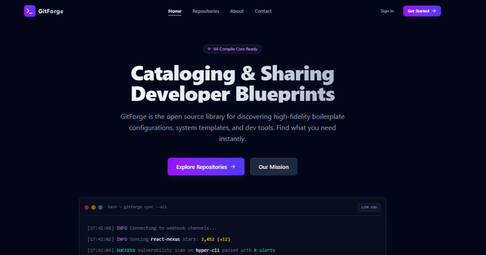
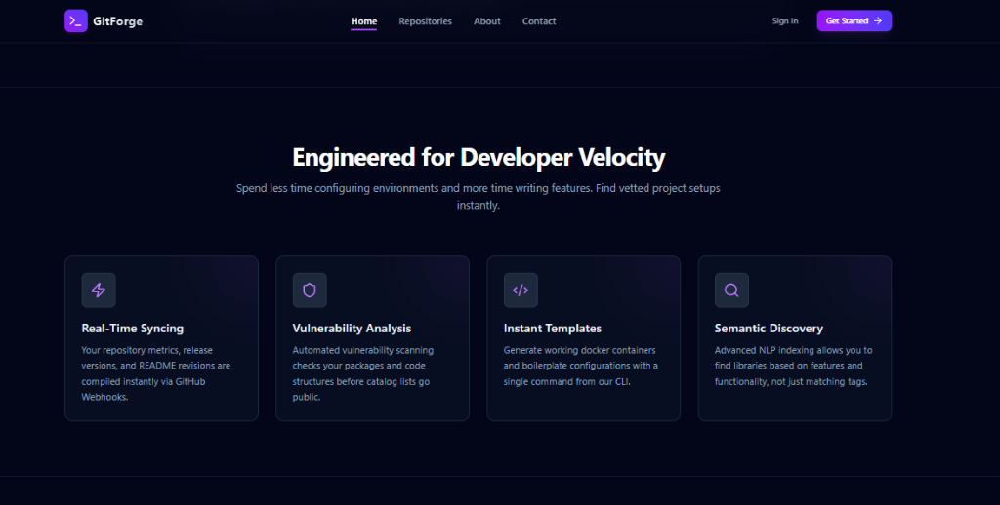

# GitForge — Developer Repository Showcase & SaaS Platform

GitForge is a high-fidelity, modern developer-focused template catalog and SaaS portal. It allows teams and individual developers to index, audit, and share boilerplate configurations, CLI scripts, and open-source packages. Built with Vite, React 19, Tailwind CSS v4, and React Router.

---

## 📸 Screenshots

### 1. Landing Hero & Interactive Shell
Features a dark-themed futuristic hero header with call-to-actions and a live simulated terminal log widget showing repository synchronization logs.


### 2. Capabilities & Features Matrix
Showcases core functionalities (vulnerability scanning, real-time webhooks, semantic search) in a beautiful glow-bordered grid.


### 3. Customer Testimonials
Features sleek rating grids, user quotes, and rounded platform profiles.


---

## 🚀 Key Features

- **Responsive Multi-page Routing**: Fully configured navigation map supporting Homepage (`/`), Repository Browser (`/products`), About (`/about`), and Contact (`/contact`).
- **Interactive Repository Search & Filter**: Search repositories by title, description, or technology tags. Filter dynamically by categories (Boilerplates, CLI, Libraries, Utilities) and sort by stars or forks.
- **Contact Form Validation**: Full client-side input validation checking fields, email structures, and length constraints with a customized success modal.
- **Polished Glassmorphism Theme**: Dark slate palette with interactive gradient buttons, blurred headers, and transitions.

---

## 🛠️ Tech Stack & Dependencies

- **Core**: [React 19](https://react.dev/) + [Vite 8](https://vite.dev/)
- **Styling**: [Tailwind CSS v4](https://tailwindcss.com/) (using `@tailwindcss/vite` compiler)
- **Routing**: [React Router v7](https://reactrouter.com/)
- **Icons**: [Lucide React](https://lucide.dev/)

---

## 📦 Component Library

We created 6 reusable components to maintain a consistent style guide:
1. **`Navbar`**: Responsive header with backdrop-blur filters, active state indicators, and a mobile drawer.
2. **`Footer`**: Multi-column site directory, social links, and newsletter subscription form.
3. **`Button`**: Modular button wrapper supporting `primary`, `secondary`, `outline`, and `ghost` variants.
4. **`ProductCard`**: Shows detailed repository stats (stars, forks), language tags, creator avatars, and link bindings.
5. **`FeatureCard`**: Grid panels showcasing product assets with gradient icon filters.
6. **`TestimonialCard`**: Individual quote boxes rendering customer stars and corporate profiles.

---

## 💻 Getting Started

### 1. Clone & Enter Directory
```bash
cd website
```

### 2. Install Dependencies
```bash
npm install
```

### 3. Start Development Server
```bash
npm run dev
```

### 4. Build for Production
```bash
npm run build
```
